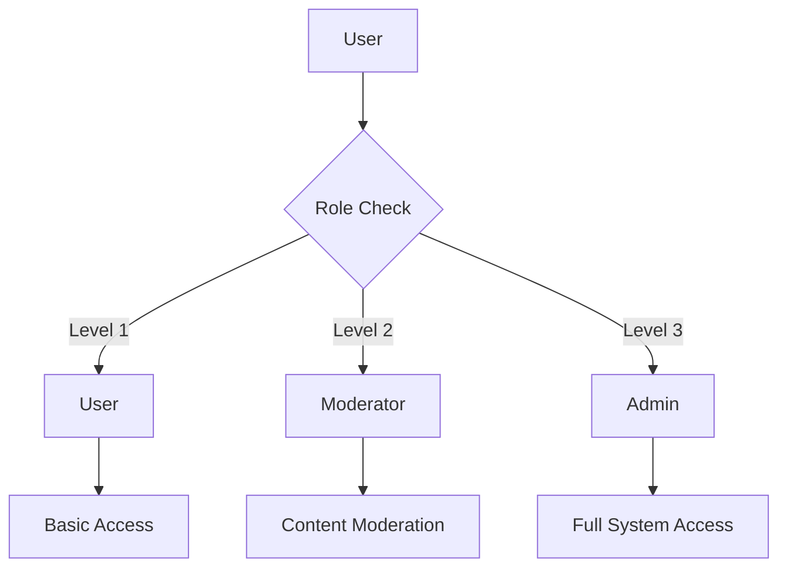
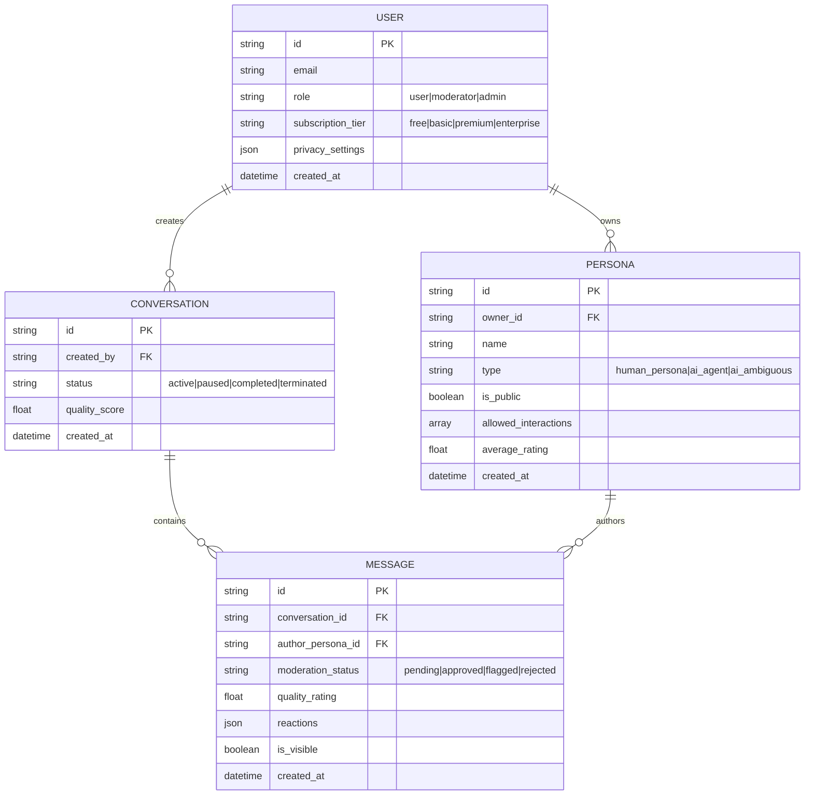
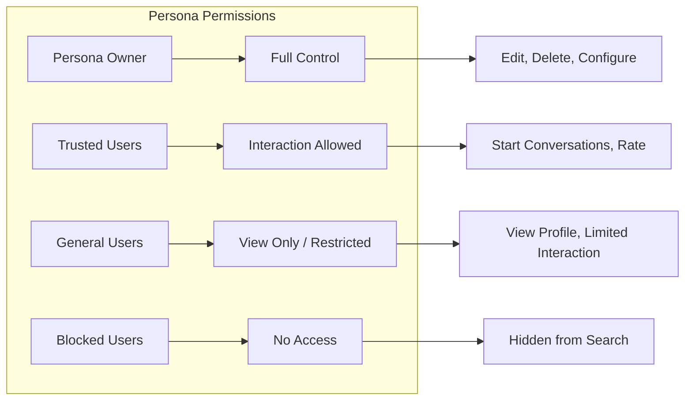
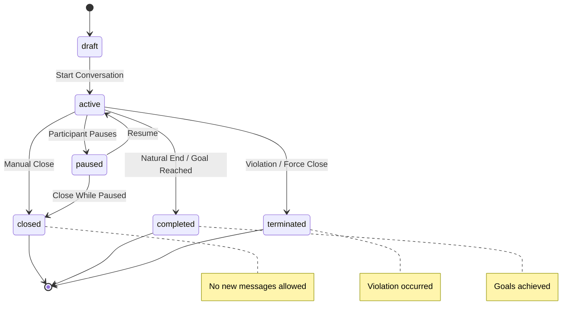
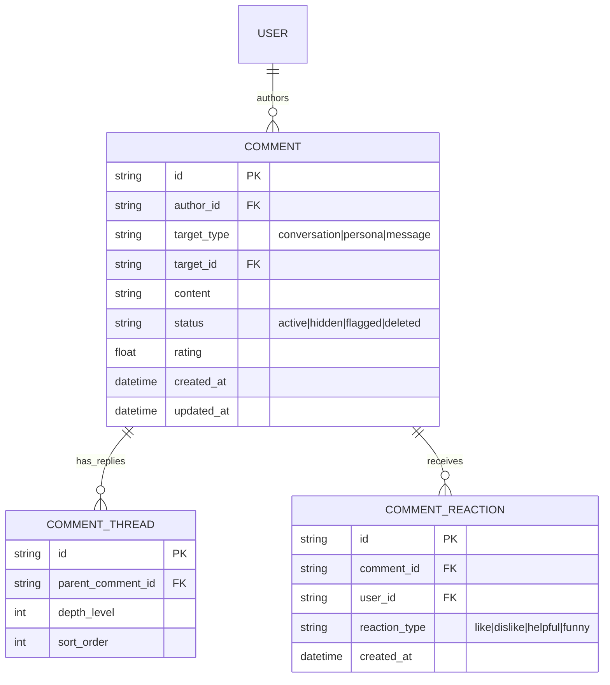
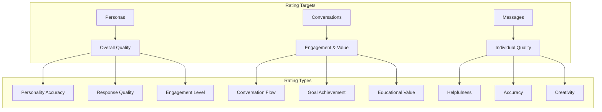
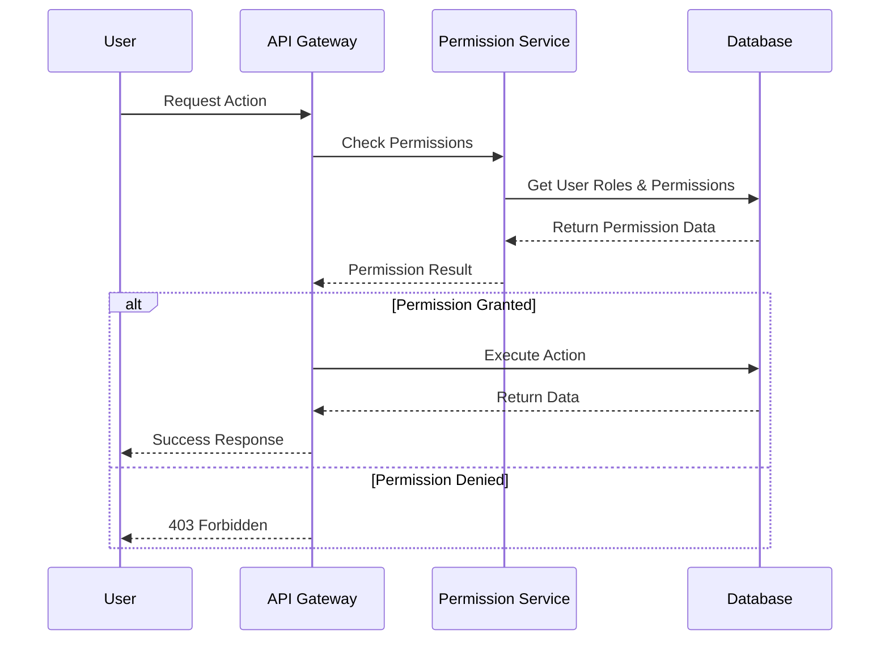

# Authentication and Permissions Design Document

## Overview

This document outlines the current authentication model and proposes enhancements for persona-based permissions, conversation state management, commenting systems, and rating mechanisms in the AmIAnAI platform.

## Current Architecture Analysis

### Existing User Role System



**Current Roles:**
- **User (Level 1)**: Basic platform access, can create conversations and personas
- **Moderator (Level 2)**: Can moderate content, access moderation tools
- **Admin (Level 3)**: Full system access, user management, platform configuration

### Current Data Model



## Proposed Enhancements

### 1. Enhanced Persona Permission System

#### Current Limitations
- Binary public/private personas
- No granular permission control
- Limited interaction type restrictions

#### Proposed Persona Permission Matrix



**New Permission Types:**

```typescript
type PersonaPermissionLevel = 
  | 'private'      // Owner only
  | 'trusted'      // Owner + trusted user list
  | 'followers'    // Users who follow this persona
  | 'public'       // Anyone can interact
  | 'restricted'   // Public view, limited interaction

interface PersonaPermissions {
  viewProfile: PersonaPermissionLevel;
  startConversation: PersonaPermissionLevel;
  ratePersona: PersonaPermissionLevel;
  commentOnPersona: PersonaPermissionLevel;
  viewConversationHistory: PersonaPermissionLevel;
  inviteToConversation: PersonaPermissionLevel;
}

interface PersonaAccessControl {
  permissions: PersonaPermissions;
  trustedUsers: string[];           // User IDs with trusted access
  blockedUsers: string[];           // User IDs with blocked access
  followerRequiresApproval: boolean; // Must approve followers
  maxConcurrentConversations: number;
  allowRating: boolean;
  allowComments: boolean;
}
```

### 2. Conversation State Management

#### Enhanced Conversation States



**Enhanced Conversation Model:**

```typescript
type ConversationStatus = 
  | 'draft'       // Being set up
  | 'active'      // Ongoing conversation
  | 'paused'      // Temporarily stopped
  | 'completed'   // Finished successfully
  | 'closed'      // Manually ended (no new messages)
  | 'terminated'  // Force-closed due to violations

interface ConversationControl {
  status: ConversationStatus;
  canAddMessages: boolean;          // False when closed/completed/terminated
  closeReason?: string;             // Why conversation was closed
  closedBy?: string;                // User ID who closed it
  closedAt?: Date;
  allowComments: boolean;           // Can users comment on this conversation
  allowRating: boolean;             // Can users rate this conversation
  isPubliclyViewable: boolean;      // Can others view this conversation
  moderationLevel: 'none' | 'light' | 'strict';
}
```

### 3. Universal Comment System

#### Comment Architecture



**Comment Model:**

```typescript
interface Comment {
  id: string;
  authorId: string;
  targetType: 'conversation' | 'persona' | 'message';
  targetId: string;
  content: string;
  status: 'active' | 'hidden' | 'flagged' | 'deleted';
  rating?: number;              // Optional rating with comment
  parentCommentId?: string;     // For threaded replies
  depth: number;                // Nesting level
  reactions: CommentReaction[];
  moderationFlags: string[];
  createdAt: Date;
  updatedAt: Date;
}

interface CommentReaction {
  id: string;
  userId: string;
  type: 'like' | 'dislike' | 'helpful' | 'funny' | 'insightful';
  createdAt: Date;
}
```

### 4. Comprehensive Rating System

#### Multi-Level Rating Architecture



**Enhanced Rating System:**

```typescript
interface PersonaRating {
  id: string;
  personaId: string;
  raterId: string;
  conversationId?: string;        // Context of the rating
  
  // Multi-dimensional ratings
  personalityAccuracy: number;    // 1-5: How well persona stayed in character
  responseQuality: number;        // 1-5: Quality of responses
  engagementLevel: number;        // 1-5: How engaging the persona was
  overallRating: number;          // 1-5: Overall experience
  
  // Optional detailed feedback
  strengths: string[];            // What worked well
  improvements: string[];         // What could be better
  wouldUseAgain: boolean;
  
  // Metadata
  conversationLength: number;     // Number of messages in context
  createdAt: Date;
}

interface ConversationRating {
  id: string;
  conversationId: string;
  raterId: string;
  
  // Experience ratings
  conversationFlow: number;       // 1-5: How natural the flow was
  goalAchievement: number;        // 1-5: Were goals met
  educationalValue: number;       // 1-5: Did you learn something
  entertainment: number;          // 1-5: Was it enjoyable
  overallSatisfaction: number;    // 1-5: Overall rating
  
  // Recommendation
  wouldRecommend: boolean;
  difficulty: 'easy' | 'moderate' | 'challenging';
  
  // Open feedback
  highlights: string;             // Best parts
  suggestions: string;            // Improvements
  
  createdAt: Date;
}

interface MessageRating {
  id: string;
  messageId: string;
  raterId: string;
  
  // Quick ratings
  helpfulness: number;            // 1-5
  accuracy: number;               // 1-5
  creativity: number;             // 1-5
  
  // Reactions (lightweight alternative to full rating)
  reaction?: 'helpful' | 'insightful' | 'funny' | 'confusing' | 'inappropriate';
  
  createdAt: Date;
}
```

### 5. Permission Integration Points

#### API Endpoint Security



**Permission Check Examples:**

```typescript
// Persona access control
async function canUserInteractWithPersona(
  userId: string, 
  personaId: string, 
  action: 'view' | 'startConversation' | 'rate' | 'comment'
): Promise<boolean> {
  const persona = await getPersona(personaId);
  const user = await getUser(userId);
  
  // Check if user is blocked
  if (persona.accessControl.blockedUsers.includes(userId)) {
    return false;
  }
  
  // Check permission level for action
  const requiredLevel = persona.permissions[action];
  
  switch (requiredLevel) {
    case 'private':
      return persona.ownerId === userId;
    case 'trusted':
      return persona.ownerId === userId || 
             persona.accessControl.trustedUsers.includes(userId);
    case 'followers':
      return await isUserFollowingPersona(userId, personaId);
    case 'public':
      return true;
    case 'restricted':
      return action === 'view' || user.subscription !== 'free';
    default:
      return false;
  }
}

// Conversation state checks
async function canAddMessageToConversation(
  userId: string, 
  conversationId: string
): Promise<boolean> {
  const conversation = await getConversation(conversationId);
  
  // Check if conversation allows new messages
  if (!conversation.control.canAddMessages) {
    return false;
  }
  
  // Check if user is a participant
  const isParticipant = await isUserParticipantInConversation(userId, conversationId);
  return isParticipant;
}
```

## Implementation Roadmap

### ✅ Phase 0: Infrastructure Foundation (COMPLETED 2025-06-19)

#### 0.1 Granular Infrastructure System ✅
**Completed:**
- ✅ Component-based deployment scripts (6 components: state-backend, networking, cognito, database, lambda, frontend)
- ✅ Main orchestrator script with dependency management
- ✅ Cognito preservation system (user accounts maintained across rebuilds)
- ✅ Individual component deployment (2-5 min vs 40 min full rebuild)
- ✅ Production infrastructure deployed and healthy

#### 0.2 Infrastructure Status ✅
- ✅ PostgreSQL database deployed with secrets management
- ✅ Lambda API deployed and healthy endpoints  
- ✅ Frontend infrastructure (CloudFront + S3) deployed
- ✅ Networking and security groups configured
- ✅ Authentication system preserved and functional

### ✅ Phase 0.5: Core Application Functionality (COMPLETED 2025-06-19)

#### 0.5.1 Authentication Integration ✅
**Completed:**
- ✅ Cognito JWT token authentication working end-to-end
- ✅ Proper Authorization headers in all API calls
- ✅ Token retrieval and validation in frontend
- ✅ Admin CLI tool with automated authentication
- ✅ API Gateway authentication middleware functional

#### 0.5.2 Core Platform Features ✅
**Completed:**
- ✅ Conversation creation and navigation working
- ✅ Message posting with database persistence
- ✅ AI response generation fully functional
- ✅ Real-time conversation updates via polling
- ✅ Admin console operational with all endpoints
- ✅ Database seeding and management tools working

### Phase 1: Code Quality & Standardization (CURRENT PRIORITY)

#### 1.1 API Client Standardization 
**Current State:**
- All API calls have proper authentication but use inconsistent patterns
- Mix of centralized apiClient and direct fetch() calls across components
- Code duplication in authentication logic

**Immediate Actions:**
1. Standardize all components to use centralized apiClient service
2. Add missing admin methods to apiClient (seedDatabase, setupDatabase, testAI)
3. Remove hardcoded API URLs in favor of centralized configuration
4. Implement consistent error handling across all API calls

#### 1.2 Enhanced Permission Foundation
**Database Changes:**
```sql
ALTER TABLE conversations ADD COLUMN status VARCHAR(20) DEFAULT 'active';
ALTER TABLE conversations ADD COLUMN can_add_messages BOOLEAN DEFAULT true;
ALTER TABLE conversations ADD COLUMN close_reason TEXT;
ALTER TABLE conversations ADD COLUMN closed_by VARCHAR(255);
ALTER TABLE conversations ADD COLUMN closed_at TIMESTAMP;
ALTER TABLE conversations ADD COLUMN allow_comments BOOLEAN DEFAULT true;
ALTER TABLE conversations ADD COLUMN allow_rating BOOLEAN DEFAULT true;
```

**API Updates:**
- Add state validation to message posting endpoints
- Implement conversation state transition logic
- Add conversation closing endpoint

**UI Features:**
- Close conversation button
- Conversation state indicators
- Message input blocking for closed conversations

#### 1.2 Basic Persona Permission Levels
**Database Changes:**
```sql
ALTER TABLE personas ADD COLUMN permission_level VARCHAR(20) DEFAULT 'public';
ALTER TABLE personas ADD COLUMN trusted_users JSON DEFAULT '[]';
ALTER TABLE personas ADD COLUMN blocked_users JSON DEFAULT '[]';
ALTER TABLE personas ADD COLUMN allow_rating BOOLEAN DEFAULT true;
ALTER TABLE personas ADD COLUMN allow_comments BOOLEAN DEFAULT true;
```

**Permission Middleware:**
```typescript
async function canUserInteractWithPersona(
  userId: string, 
  personaId: string, 
  action: 'view' | 'startConversation' | 'rate' | 'comment'
): Promise<boolean>
```

#### 1.3 Permission Integration
- Integrate permission checks into all API endpoints
- Add permission-based error responses
- Create comprehensive permission testing

### Phase 2: Fix Existing Issues with Enhanced Foundation

#### 2.1 Production Issue Resolution
**Current Issues Identified:**
- Conversation detail navigation broken on live site
- Message posting non-functional (both local and live)
- AI integration broken (both environments)

**Root Cause Analysis:**
1. Debug conversation routing with new permission system
2. Fix message posting with conversation state validation
3. Repair AI integration within permission framework

#### 2.2 Enhanced Error Handling
- Graceful permission denied states
- Better error messages for users
- Fallback behaviors for permission failures

### Phase 3: Comment System
**Database Schema:**
```sql
CREATE TABLE comments (
  id VARCHAR(255) PRIMARY KEY,
  author_id VARCHAR(255) NOT NULL,
  target_type ENUM('conversation', 'persona', 'message') NOT NULL,
  target_id VARCHAR(255) NOT NULL,
  content TEXT NOT NULL,
  status ENUM('active', 'hidden', 'flagged', 'deleted') DEFAULT 'active',
  rating DECIMAL(3,2),
  parent_comment_id VARCHAR(255),
  depth INT DEFAULT 0,
  created_at TIMESTAMP DEFAULT CURRENT_TIMESTAMP,
  updated_at TIMESTAMP DEFAULT CURRENT_TIMESTAMP ON UPDATE CURRENT_TIMESTAMP
);
```

### Phase 4: Enhanced Rating System
**Multi-dimensional Rating Tables:**
```sql
CREATE TABLE persona_ratings (
  id VARCHAR(255) PRIMARY KEY,
  persona_id VARCHAR(255) NOT NULL,
  rater_id VARCHAR(255) NOT NULL,
  conversation_id VARCHAR(255),
  personality_accuracy DECIMAL(3,2),
  response_quality DECIMAL(3,2),
  engagement_level DECIMAL(3,2),
  overall_rating DECIMAL(3,2),
  would_use_again BOOLEAN,
  created_at TIMESTAMP DEFAULT CURRENT_TIMESTAMP
);
```

### Phase 5: Advanced Permission Controls
1. Full permission matrix implementation
2. Follower/following system for personas
3. Trust network management
4. Permission analytics and optimization

## Immediate Implementation Plan (Next Session)

### 1. Database Migration for Conversation States
```sql
-- Add new columns with safe defaults
ALTER TABLE conversations 
ADD COLUMN status VARCHAR(20) DEFAULT 'active',
ADD COLUMN can_add_messages BOOLEAN DEFAULT true,
ADD COLUMN close_reason TEXT NULL,
ADD COLUMN closed_by VARCHAR(255) NULL,
ADD COLUMN closed_at TIMESTAMP NULL;

-- Update existing conversations to be 'active'
UPDATE conversations SET status = 'active', can_add_messages = true 
WHERE status IS NULL OR status = '';
```

### 2. API Endpoint Updates
**Message Posting Validation:**
```typescript
// Before creating message, check conversation state
const conversation = await conversationRepository.findById(conversationId);
if (!conversation.canAddMessages || conversation.status !== 'active') {
  throw new Error('Cannot add messages to closed conversation');
}
```

### 3. UI Controls Implementation
- Add "Close Conversation" button to conversation detail page
- Show conversation status indicators
- Disable message input for closed conversations
- Add close reason input when closing

### 4. Testing Strategy
```typescript
describe('Conversation State Management', () => {
  it('should prevent messages in closed conversations');
  it('should allow closing active conversations');
  it('should preserve close reason and metadata');
  it('should handle state transitions properly');
});
```

This phased approach ensures we build a solid foundation before tackling the current UX issues, providing a more robust and maintainable solution.

## Security Considerations

### Data Privacy
- Users should control visibility of their ratings and comments
- Anonymous rating options for sensitive feedback
- Right to delete/edit comments and ratings

### Anti-Gaming Measures
- Rate limiting on ratings and comments
- Prevent self-rating
- Flag suspicious rating patterns
- Minimum interaction time before allowing ratings

### Moderation Tools
- Automated content filtering
- Human moderation queues
- Community reporting mechanisms
- Appeals process for moderated content

## Conclusion

This enhanced permission and rating system will provide:

1. **Granular Control**: Persona owners can precisely control access
2. **Rich Feedback**: Multi-dimensional ratings provide valuable insights
3. **Community Building**: Comments and ratings foster engagement
4. **Quality Assurance**: Better ratings help users find quality content
5. **Scalable Moderation**: Automated and human moderation working together

The phased approach ensures we can deliver value incrementally while maintaining system stability and user experience.