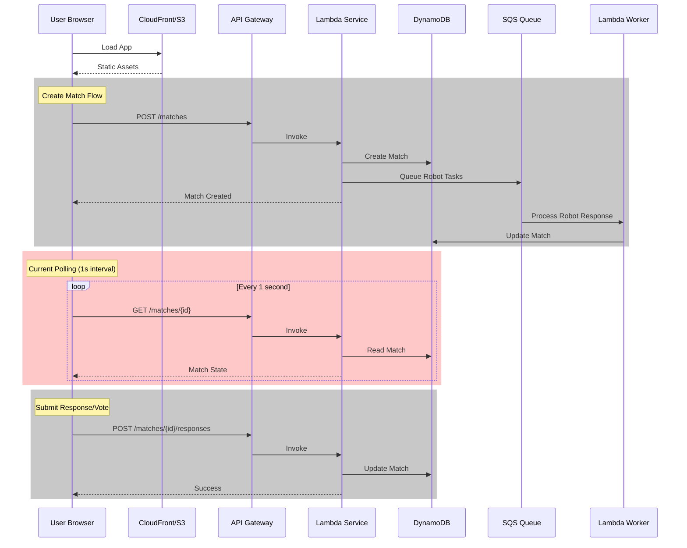
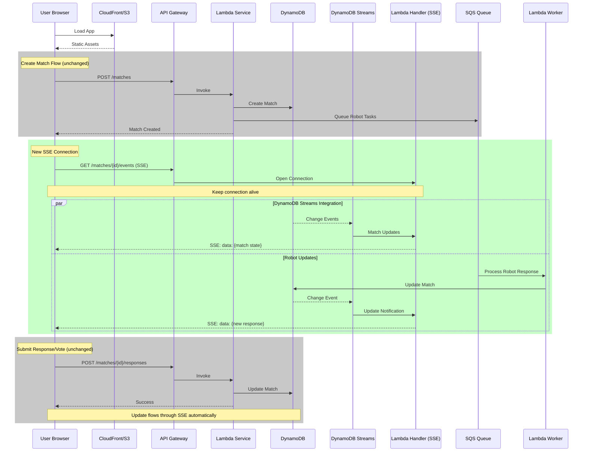

# Current Status - January 2025

## 🎮 **RobotOrchestra Production MVP**

### **✅ What's Working**

- **Complete Match Flow** - Create → Respond → Vote → Progress through 5 rounds → Match completion with results
- **End-of-Match Experience** - Full identity reveal, final scores, voting accuracy, and play again functionality
- **Robot Personalities** - 3 distinct AI participants with unique response styles
- **Real-time Updates** - 1-second polling keeps UI in sync (SSE planned for cleaner implementation)
- **Production Ready** - Live at https://robotorchestra.org
- **Admin Console** - Debug panel at /admin (restricted to nlovejoy@me.com)
- **Match Persistence** - Matches survive page refreshes via sessionStorage
- **Modular Store Architecture** - Zustand store refactored into clean modules

### **🐛 Known Issues**

- **Next.js RSC Errors** - Static export incompatible with App Router (fixing with Vite migration)
- **Responses Jumping Around** - Responses appear then reorder themselves, need stable positioning
- **Match History Broken** - Match history page not displaying correctly
- **Duplicate Prompts** - Same prompt can appear twice in one match
- **Polling Noise** - Console logs every second (will be fixed with SSE implementation)

### **🏗️ Architecture**

```
Frontend (Next.js) → API Gateway → Lambda Functions → DynamoDB
                                          ↓
                                    SQS Queue → Robot Worker → DynamoDB
```

**Infrastructure:**
- DynamoDB table with 30-day TTL
- SQS queue for async robot responses
- Lambda functions: match-service, robot-worker, match-history
- CloudFront + S3 for frontend hosting

## 📋 **Next Steps (Priority Order)**

### 1. **Migrate Frontend to Vite** (URGENT)
Next.js static export is fundamentally incompatible with our SPA architecture:
- **Week 1**: Set up Vite, migrate components, replace Next.js routing with React Router
- **Week 2**: Update CI/CD, test thoroughly, deploy
- **Benefits**: Fix RSC errors permanently, 10x faster builds, simpler architecture

#### Quick Migration Plan:
```bash
# 1. Create new Vite app
npm create vite@latest frontend-vite -- --template react-ts

# 2. Copy over:
- src/components/* (no changes needed)
- src/store/* (no changes needed)  
- src/services/* (no changes needed)
- src/contexts/* (no changes needed)
- src/types/* (no changes needed)

# 3. Replace:
- next/navigation → react-router-dom
- next/image → 
- app/* → routes/*

# 4. Delete:
- All Next.js specific tests
- next.config.js
- app directory structure

# 5. Update CI/CD:
- npm run build → vite build
- dist/ → dist/ (same output)
```

### 2. **Server-Sent Events (SSE) Implementation**
Replace noisy 1-second polling with clean real-time updates:
- Add SSE endpoint to Lambda
- Update frontend to use EventSource
- Maintain polling as fallback
- Cleaner console, better performance

### 3. **Multi-Human Matches (2 humans + 2 robots)**
Enable more social gameplay:
- Update match creation logic
- Add matchmaking/lobby system
- Handle multiple human participants
- Adjust voting/scoring logic

## 🛠️ **Development Notes**

- **Frontend Tests**: All 65 tests passing ✅
- **State Management**: Refactored to modular architecture with separate api, actions, and types ✅
- **CI/CD**: Enhanced with proper cache headers and comprehensive CloudFront invalidation ✅
- **Deployment**: Use `./scripts/deploy-lambda.sh` for Lambda updates
- **Store Architecture**: Reduced from 439 lines to 56 lines with better separation of concerns ✅
- **Error Handling**: Consistent API error handling with custom MatchServiceError class ✅

## 💰 **Cost Status**

Current: ~$5-10/month (within budget)
- Lambda invocations
- DynamoDB storage/requests
- CloudFront/S3 hosting

## 🚀 **Future Enhancements**

- Email/SMS notifications (AWS SES + SNS)
- Match history analytics
- Tournament mode
- Custom AI personalities
- Mobile app

## 📊 **Data Flow Architecture**

### Current Flow (Polling-based)



### Proposed SSE Flow (Real-time updates)



### Key Benefits of SSE Implementation

1. **Real-time Updates** - No more 1-second polling
2. **Reduced Lambda Invocations** - Cost savings
3. **Better UX** - Instant feedback when others respond
4. **Cleaner Console** - No polling noise
5. **Scalable** - DynamoDB Streams handle the pub/sub pattern