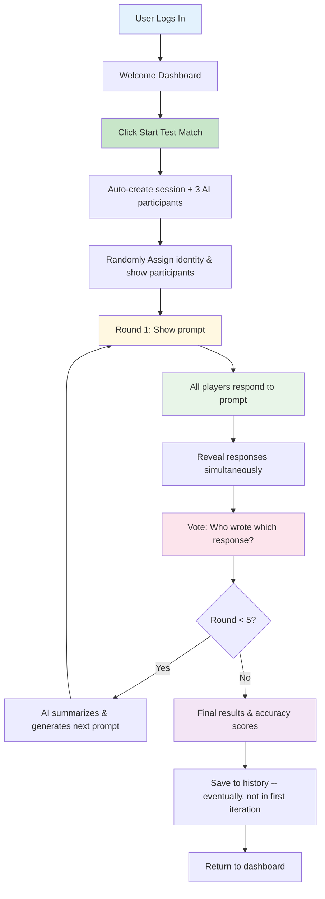
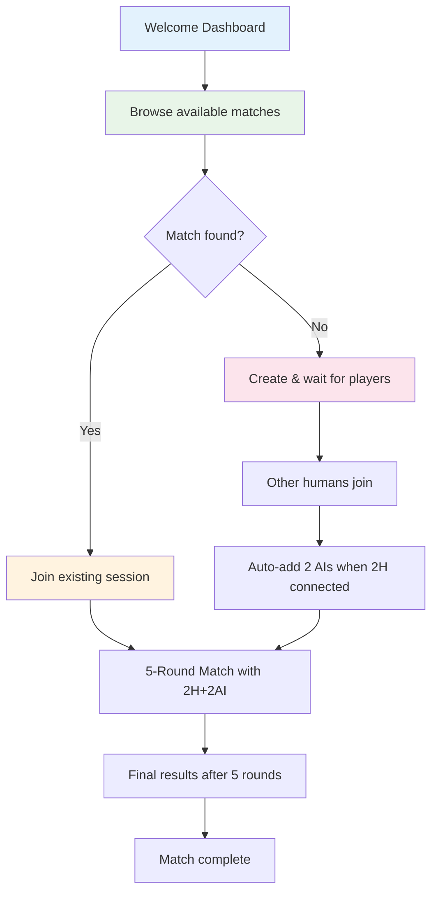
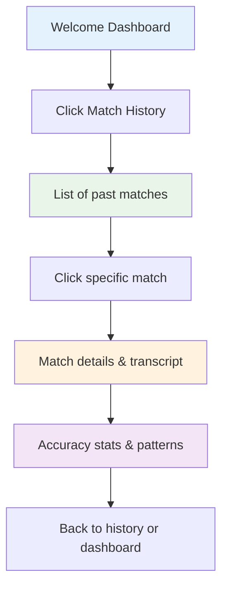

# User Journey & MVP Flow - AmIAnAI

## Vision: Post-Login User Experience

**Core Question**: _"I log in, what do I see? What do I do next?"_

**MVP Landing Page Should Show:**

1. **Existing Matches** I can join (mock data for now)
2. **Start Live Match** with a friend (button inactive - future)
3. **Start Test Match** with 3 AIs (button active - current capability)

## Current Implementation Status

### ✅ **Working Today**

- Login with Cognito authentication
- Real-time 4-player messaging with WebSocket + Lambda + DynamoDB
- Mock AI responses (3 AI personas) via TestingModeToggle
- Player identity system (A/B/C/D → Ashley/Brianna/Chloe/David) (mostly working. not randomizing yet. That needs to happen. User can't be Ashley more than about 25% of the time)
- **✅ NEW: Match/Round Backend Architecture** - Complete 5-round system deployed
- **✅ NEW: WebSocket Actions** - `join_match`, `submit_response`, `submit_vote` implemented and live
- **✅ NEW: MatchManager** - Full round state management with 30+ tests passing

### 🎯 **MVP Target State**

- **Welcome Dashboard** showing available matches and options, with a link to an About page.
- **Join Existing Match** eventually, when we have many users, this will show active matches that you can watch or join. Initially, it will just be a list of static dummy matches, although you should be able to click on those and see them even though you can't join them they should be rendered as though they were joinable, but with some sort of a badge that says match joining not fully implemented yet.
- **5-Round Match Flow** - structured prompt-response-vote cycles
- **Match History** with past results and accuracy scores (placeholder for now, build the data behind it later)

## MVP User Journeys

### **Journey 1: Test Match (Primary MVP Path)**

### **Journey 2: Browse & Join Match (Future)**

### **Journey 3: Match History & Analytics**

## **5-Round Match Experience**

### **Round Structure**

Each round follows this pattern:

1. **Prompt Display** - eventually, an AI will generate a thought-provoking question/scenario. for now randomly use one of these:"What's one thing that recently surprised you in a good way?" "If you could teleport anywhere right now, where would you go?" "What's one small thing that often makes your day better?" "What's a random act of kindness you've seen or done?" "What's a belove sound or smell that triggers nostalgia?" "What's a new idea you just came up with?"
1. **Response Phase** - All 4 players submit written responses (90 seconds max, and cumulative time is kept for the round with a 5 minute max. Display these two stats live)
1. **Reveal Phase** - All responses shown almost simultaneously (anonymously) (maybe .7 second lag so it's dramatic between each appearing)
1. **Voting Phase** - Players vote on which response was written by another human (by clicking on it and confirming. 1 vote per round - 30 seconds)
1. **Round Summary** - AI analyzes responses and transitions to next round, showing partial summary results succinctly

### **Scoring System**

1 point when you guess correctly

## MVP Implementation Plan

### **Phase 1: Welcome Dashboard (1-2 sessions)**

**Goal**: Replace current landing page with dashboard showing match options

**Components to Create**:

- `WelcomeDashboard.tsx` - Main landing page after login
- `MatchBrowser.tsx` - Show available matches to join
- `QuickActions.tsx` - "Start Test Match", "Create Live Match" buttons
- `RecentMatches.tsx` - Last 3-5 matches with quick stats

### **Phase 2: 5-Round Match Flow (3-4 sessions)**

**Goal**: Implement structured round-based gameplay: Prompt → Response → Reveal → Vote (x5) → Results

**New Components Needed**:

- `RoundInterface.tsx` - Main round container with timer and progress
- `PromptDisplay.tsx` - Show current round prompt
- `ResponseInput.tsx` - Text area for player responses (90 seconds)
- `ResponseReveal.tsx` - Display all 4 responses anonymously
- `RoundVoting.tsx` - Vote on who wrote each response (30 seconds)
- `RoundSummary.tsx` - AI analysis and transition to next round

**Backend Changes**:

- Add round management: `start_round`, `submit_response`, `submit_votes`
- Implement AI prompt generation and round summaries
- Track round-by-round scoring and final accuracy calculation
- Store complete round data for history/analysis

**Frontend Changes**:

- Replace chat interface with round-based flow
- Add round progress indicator (Round 3 of 5)
- Connect existing `ResultsScreen.tsx` to round-based scoring
- Implement state management for rounds, responses, and voting

### **Phase 3: Match History (1-2 sessions)**

**Goal**: Real match history replacing mock data

**Components**:

- Enhance existing `SessionHistory.tsx` with real data
- Add match detail view with full transcript
- User profile stats integration

### **Phase 4: Match Browser (Future)**

**Goal**: Join existing matches with other humans

**Components**:

- Real-time match listing with WebSocket updates
- "Join Match" flow with waiting room
- 2H + 2AI session management

## Key UX Decisions for MVP

### **Dashboard Design Philosophy**

- **One-click test matches**: Skip all setup, jump straight into 1H+3AI

### **Test Match Experience**

- **No waiting**: Instant match start with 3 AI participants
- **Clear timer**: "4:32 remaining" countdown in header
- **Voting tutorial**: First-time users get "Select who you think is human" as do slow deciders, with the instruction to click on the text of the human

## Technical Foundation Status

### ✅ **Ready**

- Authentication (Cognito)
- Real-time messaging (WebSocket + Lambda + DynamoDB)
- UI components (chat, voting, results)
- Mock AI responses (3 personas)

### 🎯 **MVP Gaps**

- **Dashboard landing page** (replace current navigation)
- **Session timer & auto-progression** (chat → voting → results)
- **Match completion & storage** (results persistence)
- **History integration** (connect to real data)

### 🔮 **Future Features**

- Live matches with friends
- OpenAI integration for real AIs
- Ranked modes and leaderboards
- Social features and sharing
