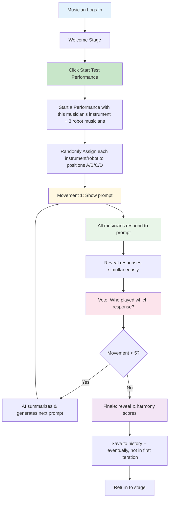

# User Performance Journey

### 🎯 **MVP Target State**

- **Welcome Stage** inviting landing page with a clear message and simple UX, including a way to join a performance right away, or review past performances
- **5-Movement Performance Flow** - structured prompt-response-vote movements. For now, robots respond ASAP. Later we will create realistic timing for the delivery of messages to the viewing area.
- **Performance History** with past results and harmony scores (placeholder for now, build the data behind it soon)

## MVP Performance Flow

