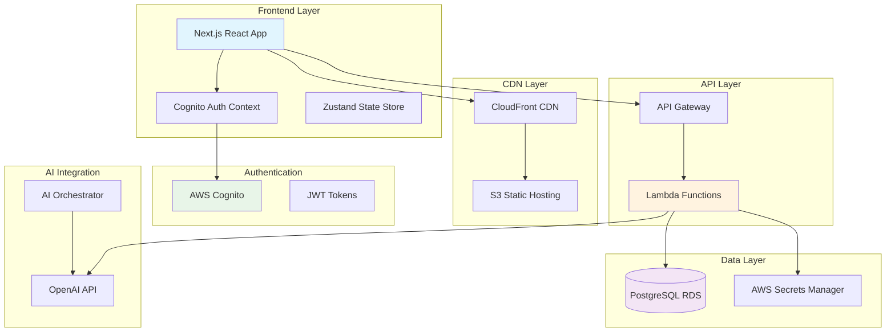
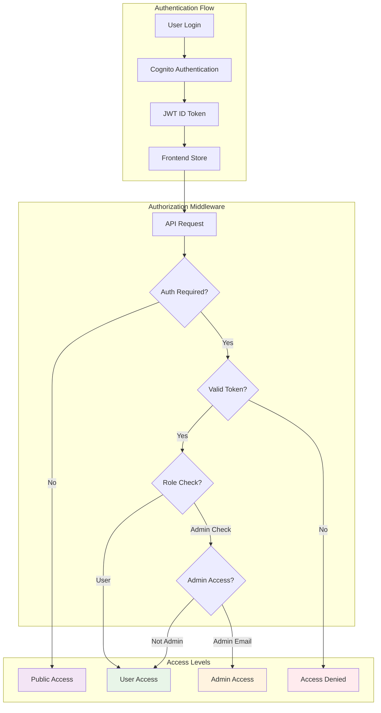
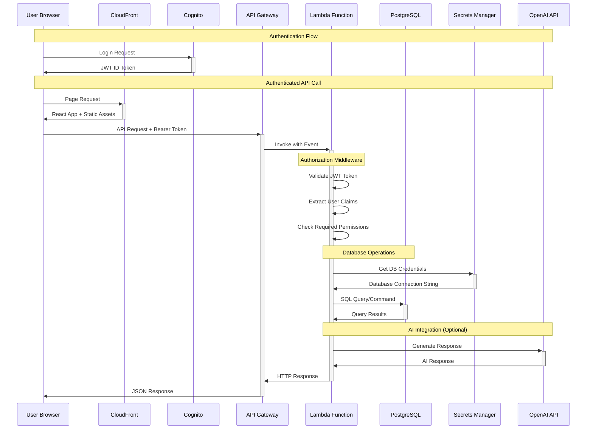
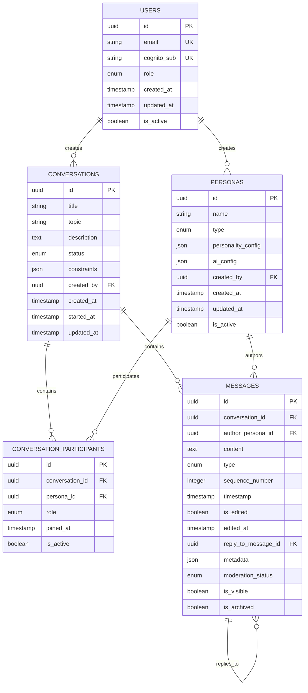
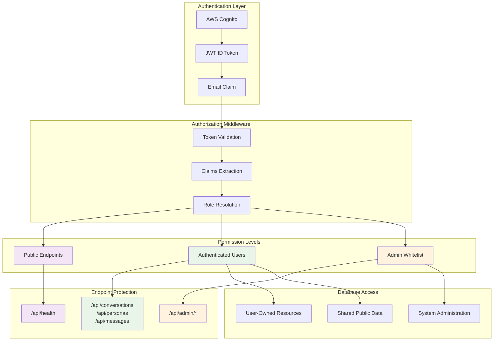
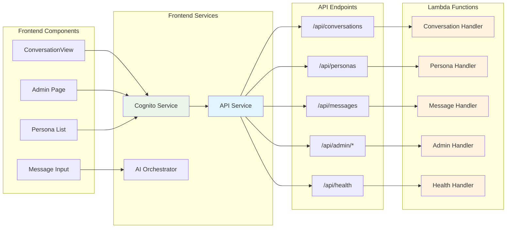
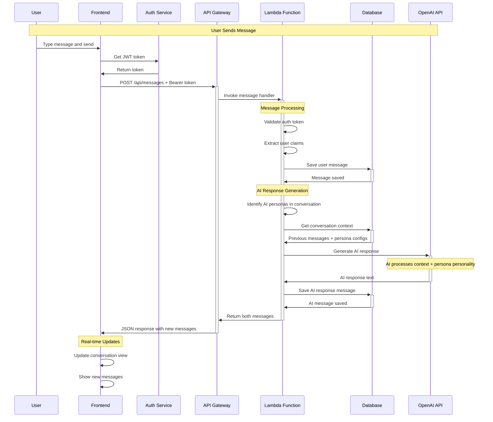
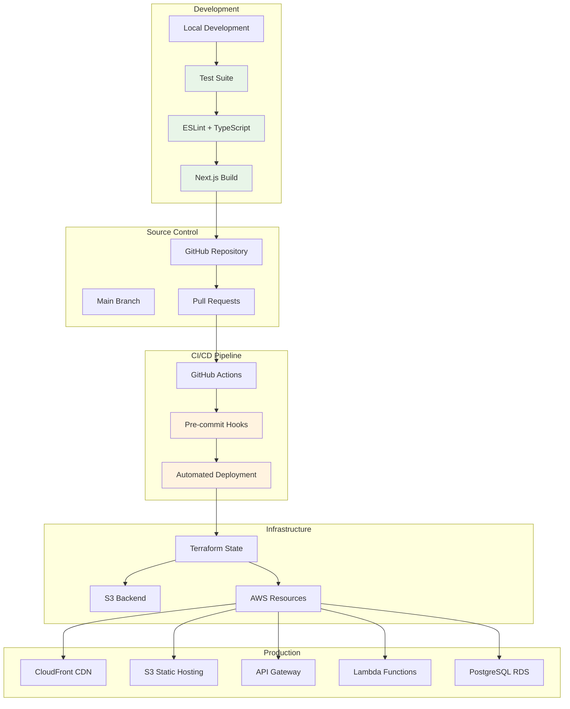

# AmIAnAI Data Architecture & Call Flow

This document provides a comprehensive overview of the AmIAnAI platform's data architecture, API call flow, and authorization model.

## 🏗️ System Overview

The AmIAnAI platform is a serverless, multi-persona conversation system built on AWS with a Next.js frontend. It features role-based access control, PostgreSQL persistence, and AI-powered conversation capabilities.

## 📊 High-Level Architecture

## 🔐 Authorization Model

## 🔄 API Call Flow

## 🗄️ Database Schema Overview

## 🛡️ Security & Permissions Model

## 📡 Frontend-Backend Communication

## 🔄 Message Flow & AI Integration

## 🛠️ Development & Deployment Flow

## 📋 Key Technical Details

### Authentication & Authorization
- **JWT Tokens**: AWS Cognito-issued ID tokens with email claims
- **Role Resolution**: Email-based admin whitelist (nlovejoy@me.com)
- **Middleware**: Lambda-based auth middleware for all protected endpoints
- **Token Validation**: Full JWT signature verification with Cognito public keys

### Database Architecture
- **PostgreSQL RDS**: Production database with VPC security
- **Connection Management**: AWS Secrets Manager for credentials
- **Schema Management**: Automated setup via admin API endpoints
- **Data Isolation**: User-owned resources with proper access controls

### API Design
- **RESTful Endpoints**: Standard HTTP methods with JSON responses
- **Error Handling**: Consistent error response format across all endpoints
- **CORS Configuration**: Proper cross-origin resource sharing setup
- **Rate Limiting**: Built-in API Gateway throttling and quotas

### Frontend Architecture
- **Next.js App Router**: Modern React with server-side generation
- **Static Export**: S3-compatible build for CDN deployment
- **State Management**: Zustand for client-side state + React Query for server state
- **Authentication Context**: React context for auth state management

### Security Considerations
- **HTTPS Everywhere**: All communication encrypted in transit
- **VPC Security**: Database isolated in private subnets
- **IAM Roles**: Least-privilege access for all AWS resources
- **Input Validation**: Server-side validation for all user inputs
- **SQL Injection Prevention**: Parameterized queries and ORM usage

This architecture ensures scalability, security, and maintainability while providing a robust foundation for AI-powered conversations.