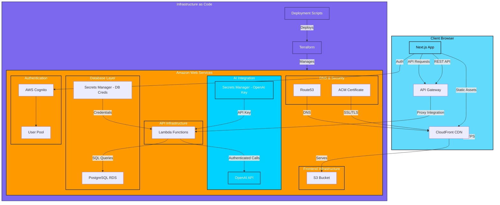

# AmIAnAI System Architecture

Current system architecture for the multi-persona conversation platform.

## Current Implementation Status

### ✅ Completed Components

**Infrastructure & Database**
- PostgreSQL RDS instance (`eeyore-postgres`) running production data
- AWS Secrets Manager for database and OpenAI API credentials
- VPC with public/private subnets and security groups
- Complete Terraform configuration with automated deployment scripts
- API Gateway with custom domain and SSL certificates

**Lambda API Layer**
- **Node.js 20.x Lambda functions** with TypeScript
- **Complete API endpoints** for conversations, personas, AI generation, admin
- **OpenAI integration** with real AI response generation
- **Database connectivity** via RDS with proper connection pooling
- **CORS configuration** for frontend integration

**Frontend Application**
- **Next.js 14 with TypeScript** and comprehensive component architecture
- **Static export deployment** to S3 with CloudFront CDN
- **Real-time AI chat functionality** with typing indicators and auto-focus
- **Conversation management** with persona selection and message persistence
- **Comprehensive test suite** (284+ tests) with robust UX validation

**AI Chat Pipeline** 
- **End-to-end AI conversations** working in production
- **OpenAI API integration** via Lambda with proper error handling
- **Message persistence** to PostgreSQL with conversation history
- **AI response triggering** based on persona types and conversation context
- **Natural conversation flow** with delays, typing indicators, and state management

**Development Workflow**
- **Production-only database strategy** with local development server
- **Automated deployment pipeline** via Terraform scripts
- **Test-driven development** with comprehensive coverage
- **Git workflow** with pre-commit validation (lint, tests, build, TypeScript)

### 🎯 Current State: Production Ready

**Fully Functional Features**
- ✅ **Create conversations** with AI personas
- ✅ **Send messages** that trigger real AI responses  
- ✅ **Conversation persistence** with full message history
- ✅ **Persona management** with personality and knowledge configuration
- ✅ **Admin tools** for database management and seeding

**Technical Performance**
- ✅ **284+ tests passing** with comprehensive coverage
- ✅ **All pre-commit checks** (lint, TypeScript, build) successful
- ✅ **Production deployment** working with AWS infrastructure
- ✅ **Real user conversations** with AI agents operational

## Architecture Decisions

### Production-Only Strategy
- **No local database** - all development uses AWS RDS
- **Hybrid development** - local Next.js + production database
- **Single environment** - simplifies deployment and testing
- **Environment parity** - eliminates dev/prod differences

### Database Design
- **PostgreSQL** on AWS RDS for relational data
- **JSONB fields** for flexible persona/conversation metadata
- **UUID primary keys** for scalability
- **Comprehensive indexes** for query performance

### Security Model
- **AWS Cognito** for user authentication
- **Secrets Manager** for database credentials
- **Environment-controlled admin** operations
- **Production database protection**

## Data Flow

### User Authentication
1. User signs up/in via Cognito
2. JWT tokens manage session state
3. Frontend validates auth status
4. Protected routes enforce authentication

### Database Operations
1. Next.js API routes connect to RDS
2. Connection pooling for performance
3. Admin endpoints for schema management
4. Repository pattern for data access

### Development Workflow
1. Local Next.js development server
2. Real-time connection to production database
3. API-based database administration
4. Build and deploy to S3/CloudFront

## Key Benefits

- **Fast iteration** - local development with real data
- **Environment consistency** - single production database
- **Simplified deployment** - direct database setup and seeding
- **Real data testing** - authentic development experience
- **Infrastructure automation** - Terraform-managed resources