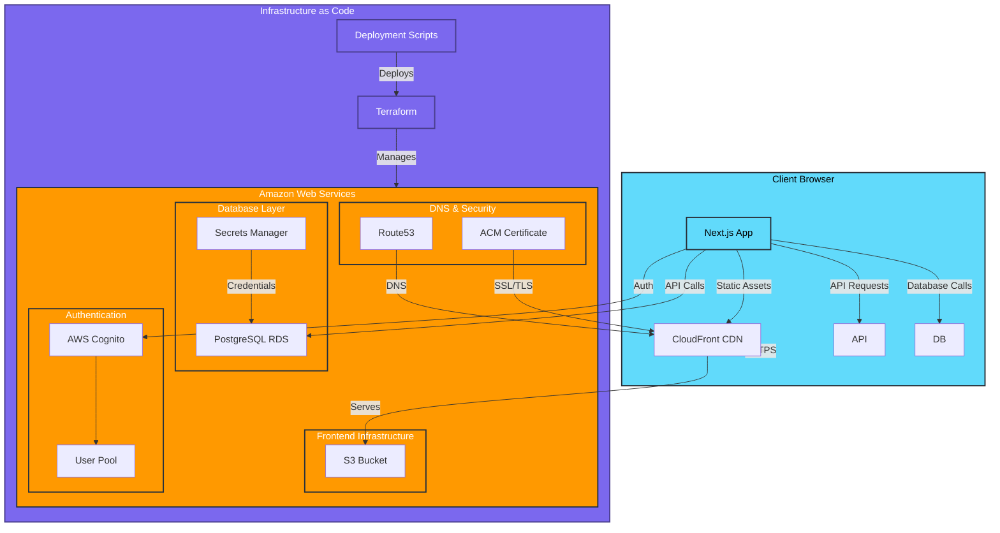

# AmIAnAI System Architecture

Current system architecture for the multi-persona conversation platform.

## Current Implementation Status

### ✅ Completed Components

**Infrastructure & Database**
- PostgreSQL RDS instance (`eeyore-postgres`) 
- AWS Secrets Manager for database credentials
- VPC with public/private subnets
- Security groups and IAM roles
- Terraform configuration with deployment scripts

**Frontend Application**
- Next.js 14 with TypeScript
- Hybrid development (local dev + production DB)
- Database admin API endpoints
- AWS Cognito integration setup
- Tailwind CSS design system
- Component architecture with proper typing

**Development Workflow**
- Production-only database strategy
- Environment variable configuration
- Database schema and seeding APIs
- Local development with production data

### 🚧 In Progress

**Database Setup**
- Schema creation via API endpoints
- Sample data seeding
- Database connection testing

**Core Features**
- User authentication flow
- Persona management system
- Conversation interface
- Message threading

### 📋 Planned Components

**Application Features**
- Multi-persona conversations
- AI agent integration
- Real-time messaging
- Conversation analytics
- User dashboard

**Infrastructure Enhancements**
- CloudWatch monitoring
- Performance optimization
- Security hardening
- Backup strategies

## Architecture Decisions

### Production-Only Strategy
- **No local database** - all development uses AWS RDS
- **Hybrid development** - local Next.js + production database
- **Single environment** - simplifies deployment and testing
- **Environment parity** - eliminates dev/prod differences

### Database Design
- **PostgreSQL** on AWS RDS for relational data
- **JSONB fields** for flexible persona/conversation metadata
- **UUID primary keys** for scalability
- **Comprehensive indexes** for query performance

### Security Model
- **AWS Cognito** for user authentication
- **Secrets Manager** for database credentials
- **Environment-controlled admin** operations
- **Production database protection**

## Data Flow

### User Authentication
1. User signs up/in via Cognito
2. JWT tokens manage session state
3. Frontend validates auth status
4. Protected routes enforce authentication

### Database Operations
1. Next.js API routes connect to RDS
2. Connection pooling for performance
3. Admin endpoints for schema management
4. Repository pattern for data access

### Development Workflow
1. Local Next.js development server
2. Real-time connection to production database
3. API-based database administration
4. Build and deploy to S3/CloudFront

## Key Benefits

- **Fast iteration** - local development with real data
- **Environment consistency** - single production database
- **Simplified deployment** - direct database setup and seeding
- **Real data testing** - authentic development experience
- **Infrastructure automation** - Terraform-managed resources