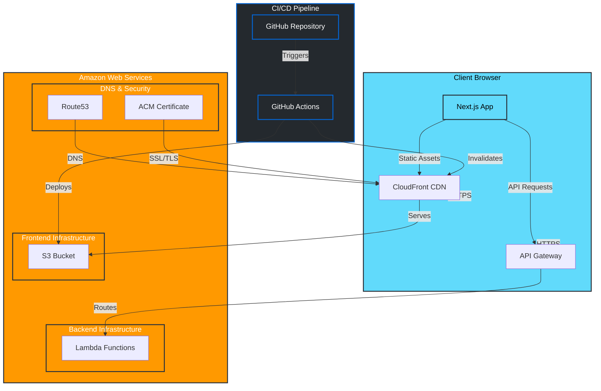

# Architecture Diagram

This diagram illustrates the system architecture of the "Am I an AI?" application.

## Implementation Status

### Built Components ✅

1. **Frontend Infrastructure**

   - Next.js application setup with TypeScript
   - Basic routing structure
   - Tailwind CSS styling
   - Component architecture
   - Basic testing setup
   - Clean, modern design system implementation

2. **AWS Infrastructure**

   - S3 bucket configuration for static hosting
   - CloudFront distribution setup
   - Route53 DNS configuration
   - ACM certificate setup
   - Basic Lambda function setup
   - Basic API Gateway configuration

3. **CI/CD Pipeline**

   - GitHub repository setup
   - Basic GitHub Actions workflow
   - Build and test automation
   - S3 deployment
   - CloudFront cache invalidation

4. **Development Environment**
   - Local development setup
   - Testing infrastructure
   - Code quality tools (ESLint, TypeScript)
   - Design system documentation

### In Progress 🚧

1. **Backend Features**

   - User authentication system
   - API endpoint implementation
   - Error handling and logging
   - Request validation

2. **Frontend Features**
   - User interface components
   - Form handling
   - Error states
   - Loading states
   - Responsive design refinements

### Planned Components 📋

1. **Security & Monitoring**

   - WAF implementation
   - CloudWatch monitoring
   - Security scanning
   - Performance monitoring

2. **Additional Features**
   - User analytics
   - Advanced text analysis
   - API rate limiting
   - Caching strategies

## Component Description

### Frontend Layer

- **Next.js Application**: React-based application with TypeScript
- **CloudFront CDN**: Global content delivery network
- **S3 Bucket**: Static website hosting
- **Design System**: Clean, modern UI components

### Backend Layer

- **API Gateway**: REST API endpoint management
- **Lambda Functions**: Serverless compute for API processing

### DNS & Security

- **Route53**: DNS management
- **ACM**: SSL/TLS certificate management

### CI/CD Pipeline

- **GitHub Repository**: Source code management
- **GitHub Actions**: Automated deployment pipeline

## Data Flow

1. **Static Content**:

   - Next.js app serves static content through CloudFront
   - CloudFront caches content at edge locations
   - S3 stores the static website files

2. **API Requests**:

   - Client makes API requests to API Gateway
   - API Gateway routes to appropriate Lambda function
   - Lambda processes request and returns response

3. **Deployment**:
   - Code changes trigger GitHub Actions
   - Actions builds and deploys to S3
   - CloudFront cache is invalidated
