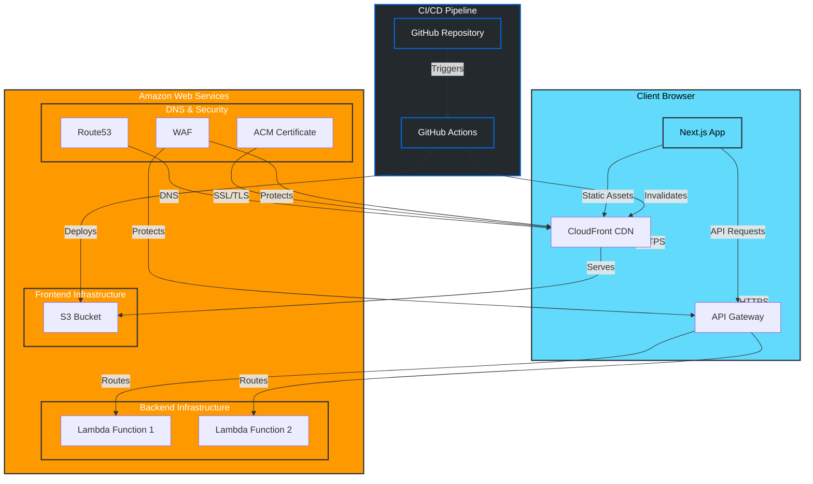

# Architecture Diagram

This diagram illustrates the system architecture of the "Am I an AI?" application.

```mermaid
graph TB
    subgraph Client[Client Browser]
        Next[Next.js App]
        Next --> |Static Assets| CDN
        Next --> |API Requests| API
    end

    subgraph AWS[Amazon Web Services]
        subgraph Frontend[Frontend Infrastructure]
            CDN[CloudFront CDN]
            S3[S3 Bucket]
            CDN --> |Serves| S3
        end

        subgraph Backend[Backend Infrastructure]
            API[API Gateway]
            Lambda1[Lambda Function 1]
            Lambda2[Lambda Function 2]
            API --> |Routes| Lambda1
            API --> |Routes| Lambda2
        end

        subgraph DNS[DNS & Security]
            Route53[Route53]
            ACM[ACM Certificate]
            WAF[WAF]
        end
    end

    subgraph CI[CI/CD Pipeline]
        GitHub[GitHub Repository]
        Actions[GitHub Actions]
        Actions --> |Deploys| S3
        Actions --> |Invalidates| CDN
    end

    %% Connections
    Client --> |HTTPS| CDN
    Client --> |HTTPS| API
    Route53 --> |DNS| CDN
    ACM --> |SSL/TLS| CDN
    WAF --> |Protects| CDN
    WAF --> |Protects| API
    GitHub --> |Triggers| Actions

    %% Styling
    classDef aws fill:#FF9900,stroke:#232F3E,stroke-width:2px,color:white
    classDef client fill:#61DAFB,stroke:#282C34,stroke-width:2px,color:black
    classDef ci fill:#24292E,stroke:#0366D6,stroke-width:2px,color:white

    class AWS,Frontend,Backend,DNS aws
    class Client,Next client
    class CI,GitHub,Actions ci
```

## Implementation Status

### Built Components ✅

1. **Frontend Infrastructure**

   - Next.js application setup with TypeScript
   - Basic routing structure
   - Tailwind CSS styling
   - Component architecture
   - Basic testing setup

2. **CI/CD Pipeline**

   - GitHub repository setup
   - Basic GitHub Actions workflow
   - Build and test automation

3. **Development Environment**
   - Local development setup
   - Testing infrastructure
   - Code quality tools (ESLint, Prettier)

### In Progress 🚧

1. **Frontend Features**

   - Portal entrance with Star Wars theme
   - User authentication system
   - Text analysis interface
   - Change-log implementation

2. **Backend Infrastructure**

   - API Gateway setup
   - Lambda function implementation
   - Authentication service
   - Text analysis service

3. **AWS Infrastructure**
   - S3 bucket configuration
   - CloudFront distribution setup
   - Route53 DNS configuration
   - ACM certificate setup
   - WAF rules implementation

### Planned Components 📋

1. **Security & Monitoring**

   - Advanced WAF rules
   - CloudWatch monitoring
   - Security scanning
   - Performance monitoring

2. **Additional Features**
   - User analytics
   - Advanced text analysis
   - Community features
   - API rate limiting

## Component Description

### Frontend Layer

- **Next.js Application**: React-based application with server components
- **CloudFront CDN**: Global content delivery network
- **S3 Bucket**: Static website hosting

### Backend Layer

- **API Gateway**: REST API endpoint management
- **Lambda Functions**: Serverless compute for API processing
- **WAF**: Web Application Firewall for security

### DNS & Security

- **Route53**: DNS management
- **ACM**: SSL/TLS certificate management
- **WAF**: Web Application Firewall

### CI/CD Pipeline

- **GitHub Repository**: Source code management
- **GitHub Actions**: Automated deployment pipeline

## Data Flow

1. **Static Content**:

   - Next.js app serves static content through CloudFront
   - CloudFront caches content at edge locations
   - S3 stores the static website files

2. **API Requests**:

   - Client makes API requests to API Gateway
   - API Gateway routes to appropriate Lambda function
   - Lambda processes request and returns response

3. **Deployment**:
   - Code changes trigger GitHub Actions
   - Actions builds and deploys to S3
   - CloudFront cache is invalidated
