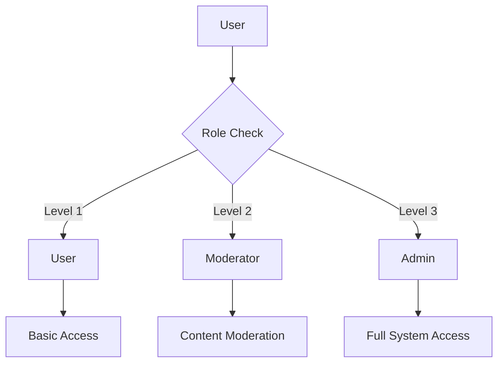
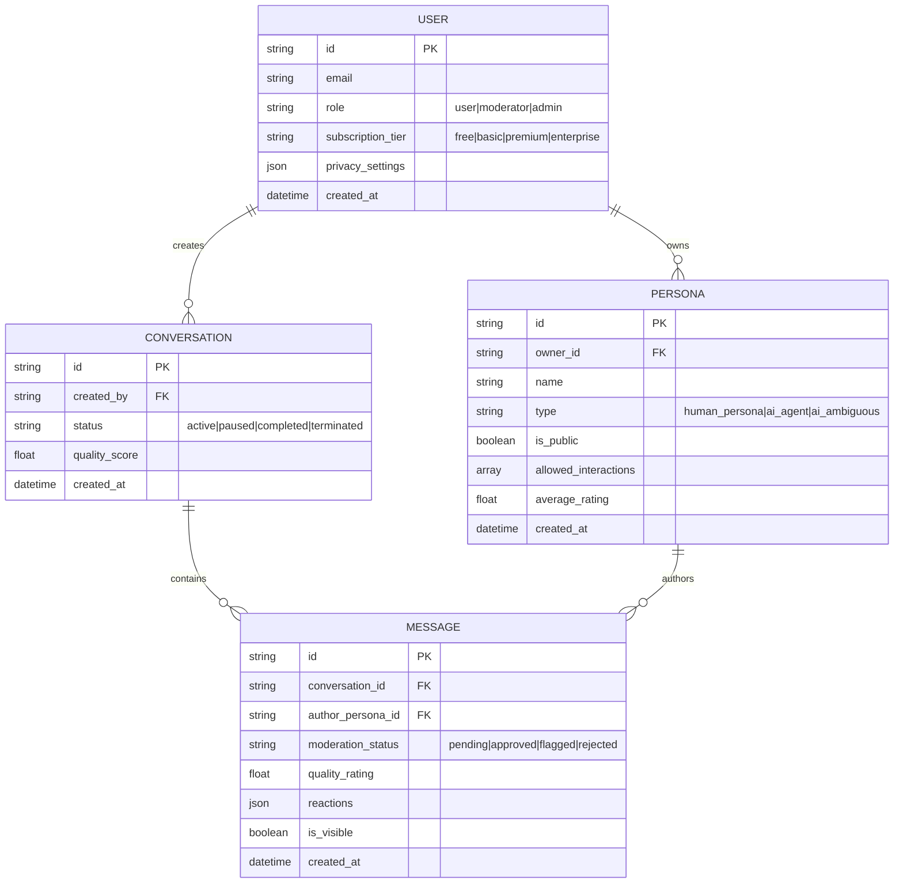
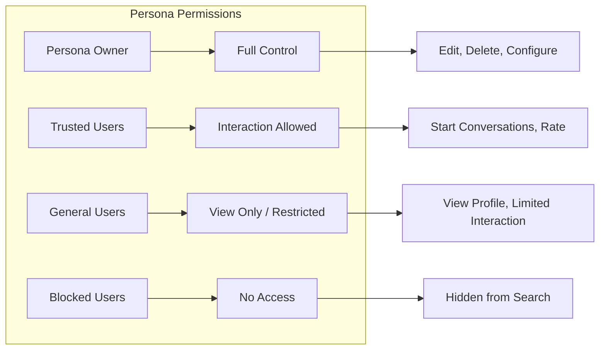
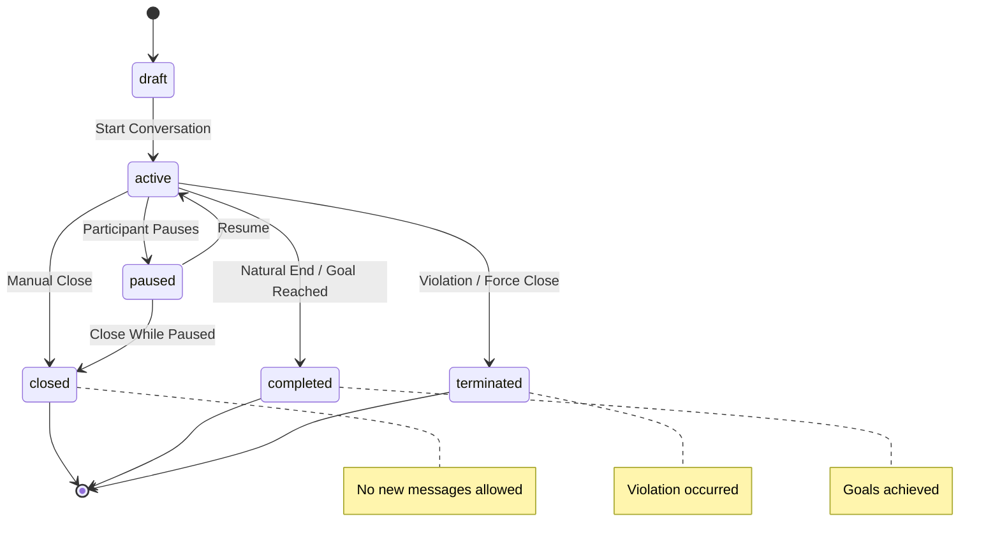
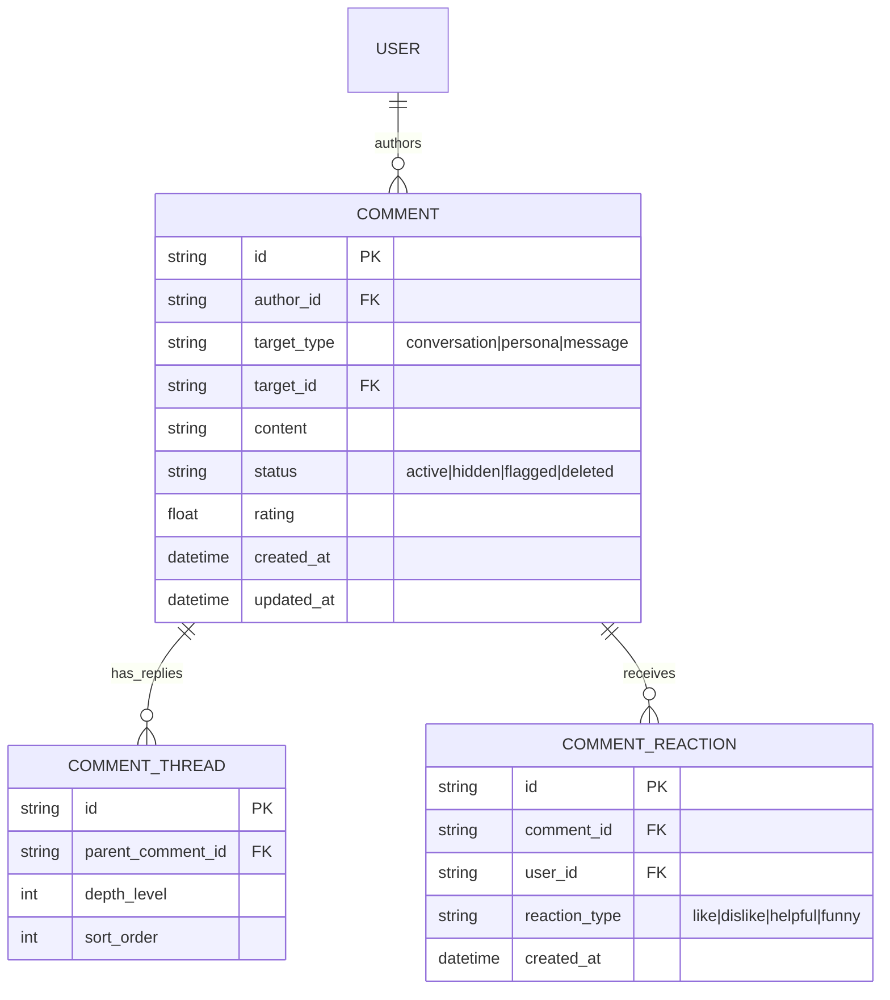
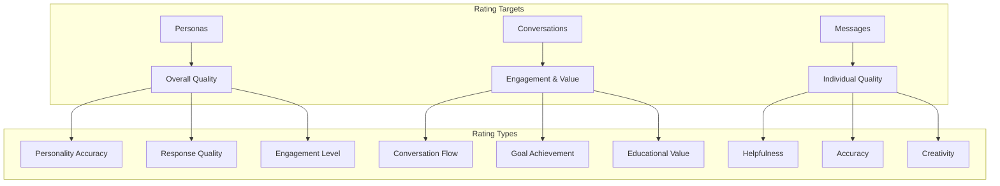
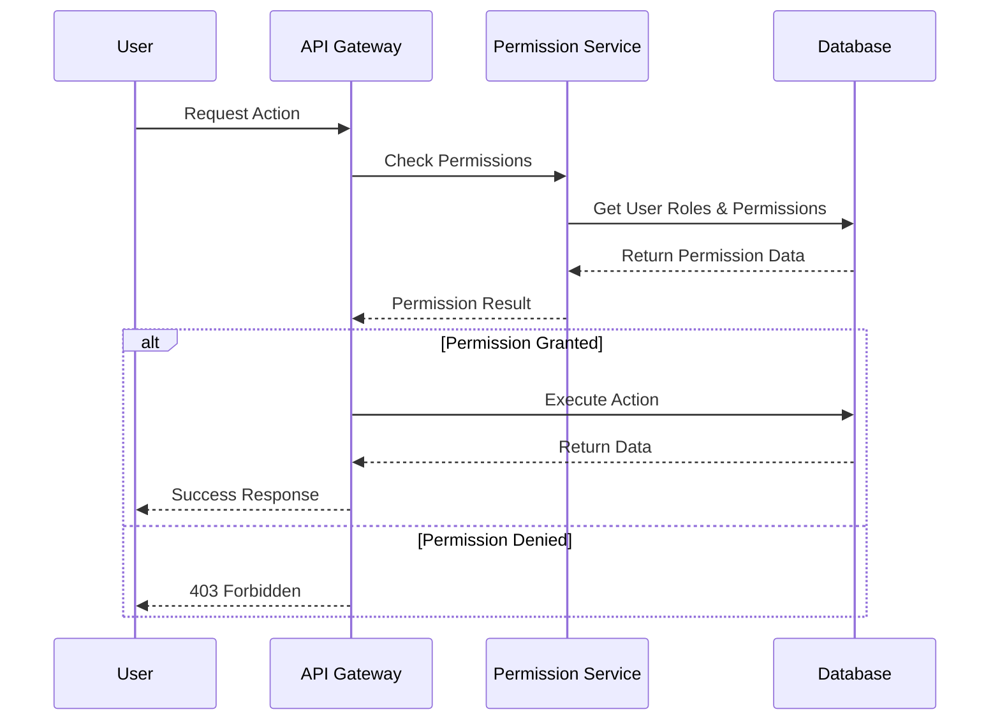

# Authentication and Permissions Design Document

## Overview

This document outlines the current authentication model and proposes enhancements for persona-based permissions, conversation state management, commenting systems, and rating mechanisms in the AmIAnAI platform.

## Current Architecture Analysis

### Existing User Role System



**Current Roles:**
- **User (Level 1)**: Basic platform access, can create conversations and personas
- **Moderator (Level 2)**: Can moderate content, access moderation tools
- **Admin (Level 3)**: Full system access, user management, platform configuration

### Current Data Model



## Proposed Enhancements

### 1. Enhanced Persona Permission System

#### Current Limitations
- Binary public/private personas
- No granular permission control
- Limited interaction type restrictions

#### Proposed Persona Permission Matrix



**New Permission Types:**

```typescript
type PersonaPermissionLevel = 
  | 'private'      // Owner only
  | 'trusted'      // Owner + trusted user list
  | 'followers'    // Users who follow this persona
  | 'public'       // Anyone can interact
  | 'restricted'   // Public view, limited interaction

interface PersonaPermissions {
  viewProfile: PersonaPermissionLevel;
  startConversation: PersonaPermissionLevel;
  ratePersona: PersonaPermissionLevel;
  commentOnPersona: PersonaPermissionLevel;
  viewConversationHistory: PersonaPermissionLevel;
  inviteToConversation: PersonaPermissionLevel;
}

interface PersonaAccessControl {
  permissions: PersonaPermissions;
  trustedUsers: string[];           // User IDs with trusted access
  blockedUsers: string[];           // User IDs with blocked access
  followerRequiresApproval: boolean; // Must approve followers
  maxConcurrentConversations: number;
  allowRating: boolean;
  allowComments: boolean;
}
```

### 2. Conversation State Management

#### Enhanced Conversation States



**Enhanced Conversation Model:**

```typescript
type ConversationStatus = 
  | 'draft'       // Being set up
  | 'active'      // Ongoing conversation
  | 'paused'      // Temporarily stopped
  | 'completed'   // Finished successfully
  | 'closed'      // Manually ended (no new messages)
  | 'terminated'  // Force-closed due to violations

interface ConversationControl {
  status: ConversationStatus;
  canAddMessages: boolean;          // False when closed/completed/terminated
  closeReason?: string;             // Why conversation was closed
  closedBy?: string;                // User ID who closed it
  closedAt?: Date;
  allowComments: boolean;           // Can users comment on this conversation
  allowRating: boolean;             // Can users rate this conversation
  isPubliclyViewable: boolean;      // Can others view this conversation
  moderationLevel: 'none' | 'light' | 'strict';
}
```

### 3. Universal Comment System

#### Comment Architecture



**Comment Model:**

```typescript
interface Comment {
  id: string;
  authorId: string;
  targetType: 'conversation' | 'persona' | 'message';
  targetId: string;
  content: string;
  status: 'active' | 'hidden' | 'flagged' | 'deleted';
  rating?: number;              // Optional rating with comment
  parentCommentId?: string;     // For threaded replies
  depth: number;                // Nesting level
  reactions: CommentReaction[];
  moderationFlags: string[];
  createdAt: Date;
  updatedAt: Date;
}

interface CommentReaction {
  id: string;
  userId: string;
  type: 'like' | 'dislike' | 'helpful' | 'funny' | 'insightful';
  createdAt: Date;
}
```

### 4. Comprehensive Rating System

#### Multi-Level Rating Architecture



**Enhanced Rating System:**

```typescript
interface PersonaRating {
  id: string;
  personaId: string;
  raterId: string;
  conversationId?: string;        // Context of the rating
  
  // Multi-dimensional ratings
  personalityAccuracy: number;    // 1-5: How well persona stayed in character
  responseQuality: number;        // 1-5: Quality of responses
  engagementLevel: number;        // 1-5: How engaging the persona was
  overallRating: number;          // 1-5: Overall experience
  
  // Optional detailed feedback
  strengths: string[];            // What worked well
  improvements: string[];         // What could be better
  wouldUseAgain: boolean;
  
  // Metadata
  conversationLength: number;     // Number of messages in context
  createdAt: Date;
}

interface ConversationRating {
  id: string;
  conversationId: string;
  raterId: string;
  
  // Experience ratings
  conversationFlow: number;       // 1-5: How natural the flow was
  goalAchievement: number;        // 1-5: Were goals met
  educationalValue: number;       // 1-5: Did you learn something
  entertainment: number;          // 1-5: Was it enjoyable
  overallSatisfaction: number;    // 1-5: Overall rating
  
  // Recommendation
  wouldRecommend: boolean;
  difficulty: 'easy' | 'moderate' | 'challenging';
  
  // Open feedback
  highlights: string;             // Best parts
  suggestions: string;            // Improvements
  
  createdAt: Date;
}

interface MessageRating {
  id: string;
  messageId: string;
  raterId: string;
  
  // Quick ratings
  helpfulness: number;            // 1-5
  accuracy: number;               // 1-5
  creativity: number;             // 1-5
  
  // Reactions (lightweight alternative to full rating)
  reaction?: 'helpful' | 'insightful' | 'funny' | 'confusing' | 'inappropriate';
  
  createdAt: Date;
}
```

### 5. Permission Integration Points

#### API Endpoint Security



**Permission Check Examples:**

```typescript
// Persona access control
async function canUserInteractWithPersona(
  userId: string, 
  personaId: string, 
  action: 'view' | 'startConversation' | 'rate' | 'comment'
): Promise<boolean> {
  const persona = await getPersona(personaId);
  const user = await getUser(userId);
  
  // Check if user is blocked
  if (persona.accessControl.blockedUsers.includes(userId)) {
    return false;
  }
  
  // Check permission level for action
  const requiredLevel = persona.permissions[action];
  
  switch (requiredLevel) {
    case 'private':
      return persona.ownerId === userId;
    case 'trusted':
      return persona.ownerId === userId || 
             persona.accessControl.trustedUsers.includes(userId);
    case 'followers':
      return await isUserFollowingPersona(userId, personaId);
    case 'public':
      return true;
    case 'restricted':
      return action === 'view' || user.subscription !== 'free';
    default:
      return false;
  }
}

// Conversation state checks
async function canAddMessageToConversation(
  userId: string, 
  conversationId: string
): Promise<boolean> {
  const conversation = await getConversation(conversationId);
  
  // Check if conversation allows new messages
  if (!conversation.control.canAddMessages) {
    return false;
  }
  
  // Check if user is a participant
  const isParticipant = await isUserParticipantInConversation(userId, conversationId);
  return isParticipant;
}
```

## Implementation Roadmap

### Phase 1: Conversation State Management
1. Add conversation state controls
2. Implement message blocking for closed conversations
3. Add conversation closing UI

### Phase 2: Enhanced Persona Permissions
1. Extend persona permission model
2. Implement permission checking middleware
3. Update persona management UI

### Phase 3: Comment System
1. Create comment database tables
2. Implement comment API endpoints
3. Build comment UI components

### Phase 4: Rating System Enhancement
1. Expand rating data models
2. Create rating collection interfaces
3. Build rating display and analytics

### Phase 5: Integration and Polish
1. Integrate all permission systems
2. Add comprehensive testing
3. Performance optimization
4. Admin tools for managing permissions

## Security Considerations

### Data Privacy
- Users should control visibility of their ratings and comments
- Anonymous rating options for sensitive feedback
- Right to delete/edit comments and ratings

### Anti-Gaming Measures
- Rate limiting on ratings and comments
- Prevent self-rating
- Flag suspicious rating patterns
- Minimum interaction time before allowing ratings

### Moderation Tools
- Automated content filtering
- Human moderation queues
- Community reporting mechanisms
- Appeals process for moderated content

## Conclusion

This enhanced permission and rating system will provide:

1. **Granular Control**: Persona owners can precisely control access
2. **Rich Feedback**: Multi-dimensional ratings provide valuable insights
3. **Community Building**: Comments and ratings foster engagement
4. **Quality Assurance**: Better ratings help users find quality content
5. **Scalable Moderation**: Automated and human moderation working together

The phased approach ensures we can deliver value incrementally while maintaining system stability and user experience.